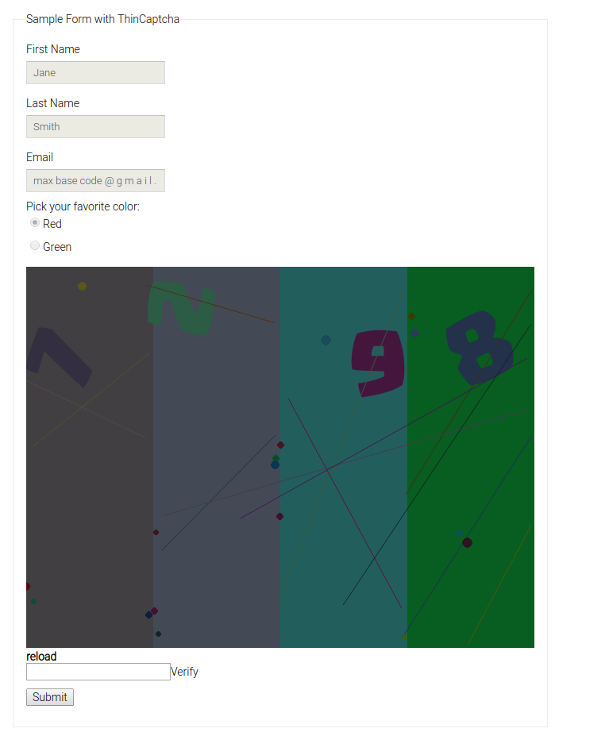

# Matno Contest - Back-End Programming

# Sample Captcha API

Implementing a **captcha service** using PHP and javascript to can use it anywhere such as Web.

## Using

We did create one example project in `example/` directory.



### Create captcha

Every requests need `token` and `key` value in Headers.

http://localhost/matno3/?method=create

```json
{
	status: "success",
	message: "",
	result: {
		code: "klk8gab4tkcmemvk1dj7tzsskh4xw3rf2153l1he9l92o9bgfa"
	}
}
```

### Verify a captcha

http://localhost/matno3/?method=verify&value=707&code=klk8gab4tkcmemvk1dj7tzsskh4xw3rf2153l1he9l92o9bgfa

```json
{
	status: "failed",
	message: "Your session is not valid!"
}
```

http://localhost/matno3/?method=verify&value=7636&code=klk8gab4tkcmemvk1dj7tzsskh4xw3rf2153l1he9l92o9bgfa

```json
{
	status: "success",
	message: "You are wellcome!",
	result: {
		token: "tglu9ph4mssfdvt5s8hal3rggcvdy9nfintbpsn829vhpq9lmc"
	}
}
```

### Done captcha using server-side programming language

http://localhost/matno3/?method=done&token=badvalue

```json
{
	status: "failed",
	message: "Your session is not valid!"
}
```

http://localhost/matno3/?method=done&token=tglu9ph4mssfdvt5s8hal3rggcvdy9nfintbpsn829vhpq9lmc

```json
{
	status: "success",
	message: "Enjoy from it, Done!"
}
```

---------

# Max Base

My nickname is Max, Programming language developer, Full-stack programmer. I love computer scientists, researchers, and compilers. ([Max Base](https://maxbase.org/))

## Asrez Team

A team includes some programmer, developer, designer, researcher(s) especially Max Base.

[Asrez Team](https://www.asrez.com/)
